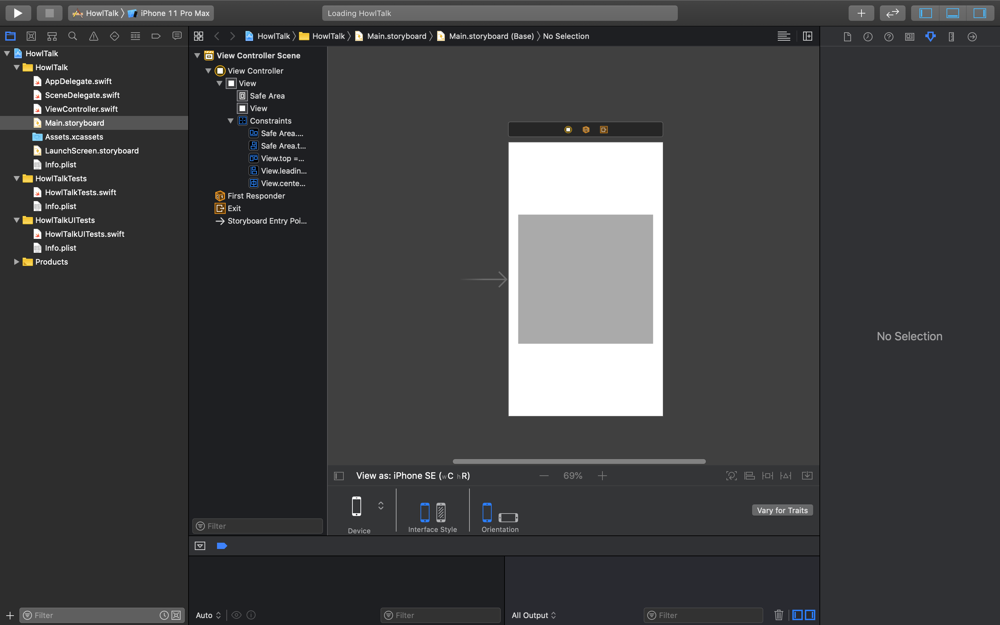
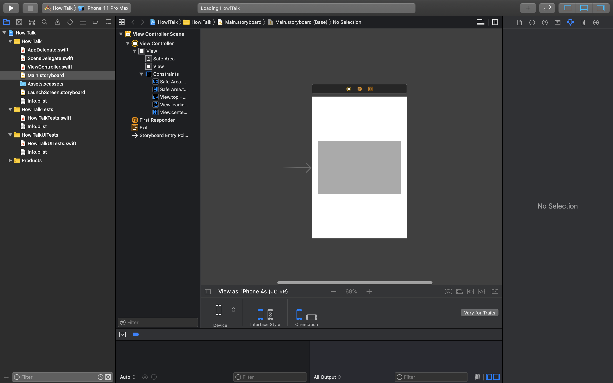

# XCode 시작하기
## XCode 프로젝트 만들기


Xcode 실행 후 프로젝트를 생성합니다.


Single View App 선택한 후 다음화면으로 이동한다.


**ProjectName**과 **InterfaceBuilder**를 **StoryBoard**로 선택한 이후에 진행하도록 하겠습니다.


## XCode 구조
**XCode** 구조는 처음 보면 복잡해 보이지만 살펴보면 체계적으로 설계가 되어 있습니다.


가장 왼쪽에 화면은 파일선택 화면으로 Class, 리소스파일 혹은 프로젝트를 선택할수 있으며 내가 원하는 경로 갈 수 있도록 도와주는 가장 중요한 화면이라고 보면 됩니다.

그 다음으로 중앙에 있는 상세 화면이 있습니다.  상세 화면은 파일 선택화면에서 설정한 파일을 상세하게 나와있는 화면이라고 보면됩니다.  이 부분은 선택한 클래스를 코딩 하거나 프로젝트를 설정할때 사용한다고 보시면 됩니다.

맨 오른쪽에 있는 상세설정 화면 같은 경우 상세화면의 정보를 좀 더 상세하게 설정하는 화면이라고 보면 됩니다. 상세화면에서 설정하지 못하는 부분을 설정하는 부분이라고 보면 됩니다.

그 다음으로 하단에 로그 화면이 있습니다. 이 부분은 로그가 발생되는 화면 입니다. 앱을 실행하게되면 로그를 확인할 수가 있습니다.

마지막으로는 맨 상단에 있는 앱을 실행하는 버튼들로 이루워져있습니다. 이 부분은 앱 실행 및 디바이스 설정 화면 이라고 보면 됩니다. 가상의 아이폰인 시뮬레이터 디바이스를 설정할 수 있으며 재생버튼 통해서 앱을 실행할 수 있습니다.

### 프로젝트 설정

먼저 파일 관리하는 부분에서 프로젝트 설정하는 부분을 살펴보도록 하겠습니다. 프로젝트를 하는 부분은 파일선택 화면에서 맨 맨위 부분 입니다. 여기를 클릭하시게 되면 프로젝트를 상세 설정할 수 있는 화면이 나타게 됩니다. 

이쪽 프로젝트 상세 설정 화면을 보시면 여러가지 메뉴가 있습니다. 여기서 가장 상단에 프로젝트 전체 메뉴를 선택할경우  **Info** 와  **Build Settings** 탭 메뉴가 생기는 화면으로 이동하게 됩니다. 먼저 **Info**에 대해서 설명하면 총 3가지로 구성이 되어 있습니다.


#### Info


**첫번째** 보시면 **Deployment Target**은 IOS SDK 빌드와 앱이 IOS 몇 버전 이상해서 실행할지 범위를 설정하는 부분입니다. 타겟을 12로 입력하게되면 그 아래 IOS 미만의 버전들에서는 앱 실행할 수가 없습니다. 그렇기 때문에 하위버전 호환은 어느정도 예측해서 타겟버전을 입력하는 부분이라고 보시면 됩니다.

그 다음으로  **두번째**는 **Configureations** 입니다. 이것은 빌드시 디버그 모드와 릴리즈 모드 설정하는 부분입니다. 디버그 모드는 앱을 출시하기전에 테스트 앱이라고 보시면되구요 릴리즈모드는 앱을 출시 하는 모드 입니다. 추가적으로 디버그 모드와 릴리즈 모드는 필요시 환경값을 설정할 수가 있습니다.

마지막으로 **Localizations** 입니다.  뜻은 현지화 혹은 지역화  라는 뜻으로 앱을 글로벌로 개발을 할때 현지화하는 부분이라고 보시면됩니다. 

#### Build Settings


그 다음으로 Build Settings 메뉴을 보도록 하겠습니다. 설정하는 종류가 굉장히 많습니다. 기타 설정이라고 보면 됩니다. **아키텍쳐** 설정부터 개발 사이닝 **Assets Path** 설정 **Swift Version** 설정 **Apple Clang** 설정을 할 수가 있습니다. 분류하기 힘든 기타 설정들을 관리하는 곳 입니다. 개발 초기에는 자주 사용하지 않으니 참고만 하시길 바랍니다.

#### General


그 다음으로 그 아래있는 모듈 메뉴에 대해서 나가도록 하겠습니다.
모듈메뉴에는 여러가지 탭들이 있는데  먼저 **Gerenal** 그대로 일반적인 환경설정을 하는 곳입니다.

**첫번째**는 프로젝트 이름 및 버전코드를 관리 할 수 있습니다.  
프로젝트 이름을 입력하는 곳은 여기이며 파이버에스와같은 외부 플렛폼과 연동을 할때 필요한 부분입니다. 그 아래있는 버전과 빌드는 업데이트를 할때 기록하는 부분입니다.

**두번째**는 서명 관리 부분 입니다.
앱을 만들게 되면 누가 만들었는지 앱에 서명을 해야 합니다.
왜냐하면 나중에 앱스토어 올릴때 누가 올렸는지 서명이 되어있어야 관리하기 쉬우며 혹은 악의적으로 앱을 만들 수 없도록 하기 위해서도 만든이의 서명이 필요 하기 때문입니다.

**세번째**는 Deployment Info입니다.
Deployment Info는 특정 버전 이상에서만 빌드 될수 있도록 **Deployment Target **설정할 수 있습니다.  그 아래 메뉴에서는 디바이스에서는 **아이폰**을 지원할껀지 **아이패드**까지 지원할껀지 설정 할 수 있습니다. 그 아래 메뉴에서는 Main 앱시작시 어느 스토리보드를 사용할 건지 혹은 바로 뷰 컨트롤러를 호출 할건지 설정 부분입니다. Device Orientation은 화면을 세로화면 지원할지 가로화면을 지원할지 설정하는 부분입니다. 맨아래는 StatusBar Style은 아이폰의 상태바의 테마를 설정하는 부분입니다.

**네번째**는 앱 런처 아이콘을 지정하는 부분이구요

**다섯번째**는 Embedded Binaries 추가 모듈이나 라이브러리를 수동적으로 추가 할때 쓰는 부분으로 보시면 됩니다.

#### Capabilites


그다음으로 Capabilities에 대해서 나가도록 하겠습니다. 앱의 **능력**이나 **권한**을 허가해주는 부분이라고 보시면 됩니다.

**첫번째**는 앱의 그룹 권한 입니다. 다른앱과 연동하는 것을 기능 부여해주는 부분입니다. 다른앱에 데이터를 넘겨줄때 사용합니다.

**두번째**는 백그라운드 작동 권한 입니다. 애플은 도청이나 개인정보 유출에 굉장히 민감해 합니다. 그렇기 때문에 백그라운드에서 앱이 작동하는것이 제안한적이며 백그라운드에 앱을 작동시킬때 필요한 설정을 먼저 Capablilties에서 설정 해주어야 하며 생각보다 백그라운드에서 작동할 수 있는 기능이 많지는 않습니다. **음악**, **녹음**, **네비**, **전화통화**정도 입니다.

**세번째**는 데이터 **암호화 저장 권한**입니다. 만약 앱에 중요한 정보를 저장할 경우 앱의 정보가 유출되지 않도록 **데이터를 암호화** 할 수 있습니다.

**네번째**는** 헬스킷 권한**이다. 최근 웨이러블 디바이스 생기면서 건강관련 정보를 얻을 수 있는 환경이 만들어졌습니다. 예를 들면 **심장박동**, **활동량**, **영양정보**, **수면 대한** 정보를 얻을 수 있는 권한을 부여할수 있습니다.

**다섯번째** 홈킷 설정권한으로 홈킷에 연동되는 악세사리를 통제할 수 있는 권한을 말합니다. 홈킷 악세사리는 전등, 스위치, 콘센트, 온도 조절장치, 스피커, 공기청정기.. 가전제품중에 홈킷 악세사리를 지원하는 제품은 모두 가능하다고 생각하면 됩니다.

**여섯번째**  **Inter App Audio** 기능으로 다른 말로 IAA라고 합니다. 이 기능은 다른 앱에게 출력되는 음악을 **라우팅**하고 **녹음** 할 수있게 권한을 부여해주는 것을 말입니다.

**일곱번째**는 **Keychain Sharing**으로 앱으로 로그인시 **Keychain** 접근해서 아이디와 비밀번호를 불러오거나 혹은 아이디와 비밀번호를 저장하는 권한을 부여하는 것을 말합니다.

**여덟번째** **Apple Maps** 사용 권한 입니다. 공항, 버스, 택시 정보를 불러올 수 있는 권한입니다만 미국을 제외하면 구글맵이나 우리나라 대기업이 만든 지도가 더 좋으니 이런 기능이 있다고 참고만 하시면 됩니다.

**아홉번째** 무선 악세사리 설정 권한 입니다. **와이파이**로 **악세사리**를 연결하는 기능을 말합니다.  대표적을 **Airplay**가 있습니다.

#### Resource Tags


이번에는 리소스 태그에 대해서 나가도록 하겠습니다. 먼저 리소스 다른말로 이미지나 파일에 태그을 달 수가 있는데 그 태그를 한꺼번과 관리 할수 있는 곳이라고 보시면 됩니다. 나중에 리소스가 너무 많아서 파일의 경로 관리가 힘들때 사용할 수 있습니다.


#### Info


##### info.plist
앱에 대한 정보 모든 정보를 는 info.plist가 가지고 있다고 보면 됩니다. 

##### Document Types
PDF파일을 등록하는 곳이다. PDF 파일을 관리할때 사용한다.

##### Exported UTls
사용자가 만든 Custom 파일들을 관리하는 곳이다.

##### Imported UTls
EPUB 관리하는 곳이다. EPUB International Digital Publishing Forum에서 제정한 개방형 자유 전자서적 표준 파일 입니다.

##### URL Types
이 부분은 아마 여기서 가장 자주쓰는 부분으로 종종 사파리에서 특정 URL를 클릭하면 앱이 켜지는 것을 본적이 있을 것이다. 그것을 URL Redirect 부르며 이것을 등록 관리하는 곳이다.


#### Build Settings
Build Settings와 같은 메뉴로 중복된 탭이다.


#### Build Phases && Build Rules

빌드 단계에서 라이브러리, 바이너리링크, Run Script코드를 바이너리로 어떻게 전환할지 방법을 설정하며 컴파일 규칙을 추가할 수 있음


### Xcode 파일 구조
실제 Xcode가 어떤 파일 구조로 되어있는지 살펴보자

#### APPDELEGATE


앱의 최초 시작점이라고 보면 됩니다. 내가 실행한 **앱의 전체 생명주기**를 관리 하고 있습니다. 나중에 페이스북 로그인, 구글 로그인, 파이어베이스 연동 등 외부 플렛폼 연동을 할때 코드를 입력하는 부분으로 많이 사용됩니다.  Appdelegate의 앱의 생명주기를 이용해서 앱을 잠그는 코드로 넣을 수가 있습니다.

#### ViewController

방금전에 AppDelegate는 앱 전체를 총괄하는 클래스라면 ViewController는 각각 화면 하**나를 관리하는 클래스**입니다. 만약 화면이 10개라면 10개의 뷰컨트롤러 클래스가 존재하게 됩니다.

#### Main.Storyboard

Main.StoryBoard 입니다. 앱을 만들게 되면 UI를 그려야 되는데 스토리보드가
UI 그리는 그림판이라고 보면 됩니다. 이것의 장점으로는 다른 플렛폼과 다르게 스토리보드처럼 화면 관리할 수 있습니다. 추후 설명하겠지만 화면 그리는 방법으로는 스토리보드 말고 방법여러가지가 있습니다. 하지만 Apple은 StoryBorad를 사용하는 것을 권장하고 있습니다. 

#### Assets.xcssets


아래 Assets.xcassets 있습니다. 이 폴더는 앱을 구성하는 이미지파일을 관리하는 부분이다. 만약에 내가 원하는 버튼 이미지나 혹은 사진을 넣을때 사용하고 생각하면 됩니다.

#### Laucnscreen.storyboard


그다음으로 LaunchScreen.storyboard 있습니다. 앱이 실행되는 Splash화면 즉 앱의 최초 로딩화면을 만드는 부분이다.

#### Info.plist


그 아래 info.plist에 대해서 나가도록 하겠습니다. info.plist 설정 값을 기록하는 부분 입니다.
권한 요청 창을 띄운다던가 혹은 인터넷 통신 방식 설정 버전 코드 입력등 단지 앱에 대한 정보만 입력하는 부분이라고 보면 됩니다.

#### Tests


마지막으로 아래있는 Tests와 Products 폴더가 궁금했을 겁니다. 이부분은 나중에 앱을 완성했을 경우 각각의 이벤트와 좌표를 순차적으로 넣어서  자동적으로 Xcode툴이 앱을 테스트 할 수 있도록 작동시키는 부분이다.

### XCode 상세화면

이번에는 상세화면을 살펴보도록 하겠습니다. 파일 선택화면을 보시면 .swift로 끝나는 파일들이 있습니다. swift파일을 선택해보도록 하겠습니다.


#### Swift 구조 살펴보기

##### Import 클래스


맨위에 Import가 있는 것을 볼 수가 있습니다. Import는 다른 라이브러리나 불러올때 입력하는 부분입니다.

##### 클래스 구조


그 다음으로 ViewController 클래스에 대해서 설명하도록 하겠습니다.
**첫번째** 클래스 이름 부분 입니다.
**두번째는** 상속부분으로 UIViewController 기능 상속 받는 부분입니다.
**세번째** 부분은 UIViewController의 기능인 ViewDidload 불러온 부분이구요
이 Functions 안에다가 코드를 입력하면 앱을 만들 수가 있습니다.

### ToolBox
왼쪽 상단에 있는 ToolBox에 대해서 나가도록 하겠습니다. ToolBox 사용자가 코딩 앱을 테스트를 하기 위해서 실행하는 부분 입니다.


**첫번째** 버튼은 런버튼으로 앱을 실행 시켜주는 버튼 입니다.
**두번째**는 앱 정지 버튼입니다.
**세번째**는 모듈 선택 버튼입니다. 이 부분은 라이브러리를 만들때 사용합니다.
**네번째**으로 시물레이터 선택버튼으로  아이폰 기종과 버전을 선택할 수 있습니다.

### Logcat

Logcat의 기능은 실행중인 앱에 또는 연결된 스마트폰이나 시뮬레이터의 현재 상태 정보를 표시해주는 부분입니다. 

그럼 로그켓 화면을 열기 위해서 오른쪽상단의 버튼을 클릭해주시길 바랍니다.


클릭하게 되면 하단에 로그캣 화면이 나타나는 것을 볼 수가 있습니다.


**첫번째** 로그 출력입니다. All output 은 디버그로그와 타켓한 로그를 출력 할 수 있습니다.
**두번째**는 Debugger Output으로 디버그 로그만 출력하는 부분입니다. Target Log는 출력하지 않습니다.
**세번째**으로 Target Out으로 타켓 로그만 출력 할 수 있습니다. 디버그로그는 출력되지 않습니다.


**가운데**는 로그 메세지를 출력하는 부분 입니다. 실제 아이폰이나 혹은 시뮬레이터에서 출력되는 로그를 확인 할 수 있습니다.
**입력창**은 출력된 로그 메세지를 검색할 수 있는 부분 입니다. 너무 많은 로그 메세지가 있을 경우 로그 메세지를 검색해서 빠르게 찾을 수 도 있습니다.
**휴지통 버튼**은 로그 메세지를 삭제 할 수 있는 버튼 입니다. 종종 여러번 실행하게되면 로그가 뒤섞이게 되는데 그때 로그를 다 삭제해서 필요한 타이밍의 로그만 남길 수 있습니다.
**변수, 함수 정보창**은 로그 화면창을 관리하는 버튼입니다.
## StoryBoard 사용하기
앱을 배우는데 있어서 가장 중요한 부분은 UI를 만드는 부분입니다. UI만드는 방법은 여러가지가 있지만 가장 쉽고 많이 쓰는 Storyboard로 만들도록 하겠습니다.

위젯의 종류는 많이 있지만 이번 실습에 나가는데 필요한 위젯들만 만들어보도록 하겠습니다.

 - Label
- ImageView
- Button
- TextField
- TableView
- TableViewCell


먼저 UI를 추가하는 방법은 상단의 **+**버튼을 클릭하면 추가 할 수 있습니다.

### AutoLayout
과거 아이폰 출기되었을때는 매년 기종이 한가지만 나왔을 뿐만 아니라 아래 버전과의 호환위해서 화면 크기가 고정이 되어있었습니다. 아이폰 3,3gs나 아이폰 4,4s 같은 경우 화면이 3.5인치로 고정이 되어 있을 것을 볼 수가 있습니다. 그렇기 때문에 코드상에서 절대 좌표로 UI를 표현해도 정상적으로 화면이 나왔습니다.

하지만 스티브잡스가 사망하고 팀쿡이 대표가 되면서 되면서  지금의 아이폰 점점 커지기 시작합니다. 4인치 4.7인치 5.5 인치 5.8인치 6.5인치 계속해서 큰 아이폰이 나오게 되었습니다
결국에는 절대 좌표로 UI를 표현 할 수 없게 되었고. 그래서 화면의 크기에 따라서 자동으로 레이아웃을 맞춰준다는 의미의 오토 레이아웃이라는 용어가 생기게 되었습니다.


#### Constraint 

##### Constraint 도구분석
Xcode에서 그리기는 Constraint가 모든것을 표현한다고 보시면됩니다. 하드코딩으로 화면을 그리기는 하지만 모든 핸드폰에 대응하기에는 시간과 노동이 많이 소요 되므로 Constraint으로 대체되는 추세입니다.


Constraint를 사용하기 위해서는 이 아래메뉴를 사용해야합니다.

###### Align Menu


1. 그 아래 2개는 선택된 뷰와 가로 중앙, 세로 중앙을 같이 정렬 하는 부분입니다. 
 - 세로 중앙

 - 가로 중앙


###### Add New Contraint Menu


이 메뉴는 오토레이아웃(AutoLayout)에 가장 중요한 Constraint 설정을 으로 상하좌우 마진값을 설정할 수 있을 뿐만 아니라 폭와 높이 설정하고 다른 뷰와의 폭이 높이를 특정 비율로서 뷰를 만들 수 있습니다.

그 다음 Align Menu로 선택된 뷰와 같이 정렬 하는 기능입니다. 
1. 상단 4개 같은 경우 선택된 뷰의 상하좌우 면으로 정렬하는 부분입니다. 

 - 위


 - 아래


- 왼쪽

- 오른쪽


- 높이


- 폭


**다양한 화면 대응 가능**

이미지를 보면 화면사이즈에 따라서 뷰가 따라서 적응 되는 것을 볼 수가 있다.


iPhone 11 Pro Max


iPhone 8


iPhone SE


iPhone 4s



###### Resolve Auto Layout Issue Menu

Resolve Auto Layout Issue Menu 입니다. 이 메뉴는  오토레이아웃인 Constraint 관리하는 부분이라고 생각하면됩니다. 마우스로 수정 후 업데이트 할때나 Constraint 정의시 놓친 부분을 추가 할때 혹은 자동적으로 Constraint를 주거나 혹은 Constraint 초기화 할때 사용합니다.

 - Add Missing Contraints

 - Reset to Suggested Constraints


- Clear Constraints

###### Embed In


그럼 이 부분은 즉 시스템에 자주쓰는 뷰를 추가하는 부분이라고 생각하면 됩니다. 뷰를 추가하는 **+**에서도 기능들은 여기서도 추가 할 수 있습니다. View, ScrollView , StackView,  Navigation Contoller, Tab Bar Controller를 추가를 할 수 있다.
###### Update Frame

이 부분은 원래대로 돌아도록 하는 버튼으로 사용자가 임의적으로 Constraint를 설정하지 않고 드래그로만 변경했을경우 원래 화면으로 돌아오도록 하는 부분입니다.


### Views 실습하기

#### Label
글자를 표현하는 위젯


##### 실습


1. 라벨을 생성한다.


2. 화면을 가로 세로 중앙으로 지정해보자


3. 텍스트 컬러 및 폰트 사이즈를 변경해보자.


4. Label에 Outlet을 생성해서 텍스트를 변경해보자.


 - 소스코드
```swift
class ViewController: UIViewController {

    @IBOutlet weak var textLabel: UILabel!
    override func viewDidLoad() {
        super.viewDidLoad()
        textLabel.text = "입력 테스트 중 입니다! "
    }

}

```

###### 결과


#### Button
이벤트를 실행하는 버튼

##### 실습


1. 버튼을 생성을 한다.


2. 버튼을 라벨 밑으로 배치시켜보자


3. 버튼의 텍스트과 배경색깔을 넣어보자

4. Button의 이벤트를 넣어서 “반갑습니다.”를 출력해보자.

- 소스코드
```swift
class ViewController: UIViewController {

    @IBOutlet weak var textLabel: UILabel!
    @IBOutlet weak var actionButton: UIButton!
    override func viewDidLoad() {
        super.viewDidLoad()
        textLabel.text = "입력 테스트 중 입니다! "
        
        actionButton.addTarget(self, action: #selector(actionEvent), for: .touchUpInside)
    }
    @objc func actionEvent(){
        textLabel.text = "반갑습니다!"
    }
}
```

#### TextField
글자를 입력하는 위젯

##### 실습


1. TextField를 생성한다.

2. Contraint를 걸어준다.

3. TextField의 PlaceHolder 및 색깔을 적용해보자.


```swift
import UIKit

class ViewController: UIViewController {
    @IBOutlet weak var textField: UITextField!
    @IBOutlet weak var textLabel: UILabel!
    @IBOutlet weak var actionButton: UIButton!
    override func viewDidLoad() {
        super.viewDidLoad()
        // Do any additional setup after loading the view.
        textLabel.text = "입력 테스트 중 입니다! "
        
        actionButton.addTarget(self, action: #selector(actionEvent), for: .touchUpInside)
    }
    @objc func actionEvent(){
        textLabel.text = textField.text
    }
}
```
4. TextField에 직접 넣은 값을 출력해보자.

- 결과
 
#### ImageView
이미지를 관리하는 위젯

##### 실습

1. 이미지뷰를 넣고 Contraint를 적용해보자
.png)
3. 이미지를 넣어보자

4. 버튼으로 세팅해보자

- 소스코드
```swift
import UIKit

class ViewController: UIViewController {
    
    @IBOutlet weak var changeButton: UIButton!
    @IBOutlet weak var mainImageview: UIImageView!
    override func viewDidLoad() {
        super.viewDidLoad()
        changeButton.addTarget(self, action: #selector(changeImage), for: UIControl.Event.touchUpInside)
    }
    @objc func changeImage(){
        mainImageview.image = UIImage(named: "background2")
    }
}
```
5. 버튼에 이미지를 세팅하는 코드를 넣어보자
 - 결과
  

#### Tableview
아이템들 리스트를 만드는 위젯
 


##### 실습

1. TableView과 TableViewCell과 Outlet 만들기

2. Cell의 Identifiler에 **ItemCell**값 입력
```swift
import UIKit

class ViewController: UIViewController,UITableViewDelegate,UITableViewDataSource {
    @IBOutlet weak var tableview: UITableView!
    override func viewDidLoad() {
        super.viewDidLoad()
        // Do any additional setup after loading the view.
        tableview.delegate = self
        tableview.dataSource = self
    }
    func tableView(_ tableView: UITableView, numberOfRowsInSection section: Int) -> Int {
        
    }
    
    func tableView(_ tableView: UITableView, cellForRowAt indexPath: IndexPath) -> UITableViewCell {
        
    }
}
```
3. **UITableViewDelegate**와 **UITableViewDataSource** **Protocol**을 Tableview과  연결  
```
import UIKit

class ViewController: UIViewController,UITableViewDelegate,UITableViewDataSource {
    
    var array = ["철수","민수","민정","선호"]
    
    @IBOutlet weak var tableview: UITableView!
    override func viewDidLoad() {
        super.viewDidLoad()
        // Do any additional setup after loading the view.
        tableview.delegate = self
        tableview.dataSource = self
    }
    func tableView(_ tableView: UITableView, numberOfRowsInSection section: Int) -> Int {
        return array.count
    }
    
    func tableView(_ tableView: UITableView, cellForRowAt indexPath: IndexPath) -> UITableViewCell {
        let cell = tableView.dequeueReusableCell(withIdentifier: "ItemCell", for: indexPath)
        return cell
    }
}
```
4. **Array 데이터**를 테이블에 적용

5. 데이터 맵핑을 위해서 ItemCell의 클래스 만들기
.png)
6. 이미지 넣기
```swift
import UIKit

class ViewController: UIViewController,UITableViewDelegate,UITableViewDataSource {
    
    var array = ["철수","민수","민정","선호"]
    var images = [UIImage(named: "image1"), UIImage(named: "image2"), UIImage(named: "image3"), UIImage(named: "image4")]
    @IBOutlet weak var tableview: UITableView!
    override func viewDidLoad() {
        super.viewDidLoad()
        // Do any additional setup after loading the view.
        tableview.delegate = self
        tableview.dataSource = self
    }
    func tableView(_ tableView: UITableView, numberOfRowsInSection section: Int) -> Int {
        return array.count
    }
    
    func tableView(_ tableView: UITableView, cellForRowAt indexPath: IndexPath) -> UITableViewCell {
        let cell = tableView.dequeueReusableCell(withIdentifier: "ItemCell", for: indexPath) as! ItemCell
        cell.nameLabel.text = array[indexPath.row]
        cell.imageview.image = images[indexPath.row]
        return cell
    }
}
class ItemCell: UITableViewCell {
    @IBOutlet weak var nameLabel: UILabel!
    @IBOutlet weak var imageview: UIImageView!
}
```
7. 이미지 데이터 및 어레이 맵핑