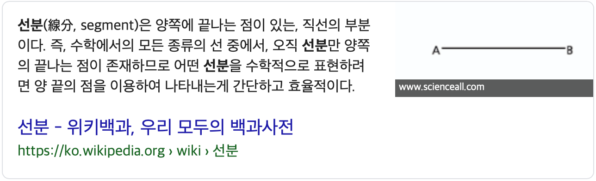

# IOS 채팅앱 만들기 2

## Segue
이 용어는 Segment에서 유래 된 말이다. 2개 이상의 ViewController를 연결시켜주는 선이라고 보면 된다. 



### 연결 방법
1. 연결

Control를 선택한 상태에서 이동할 ViewContoller를 선택해주면 된다.

2. Identifier 부여

Identifier 값을 “MainSeuge”를 입력하자.

3. 호출
Seuge를 호출하는 방법은 performSegue를 호출후 Identifier값을 넣어주면 된다.
```swift
performSegue(withIdentifier: "MainSeuge", sender: nil)
```


4. 데이터 전송
만약 호출하는 ViewController에 같이 넘겨주고 싶다면 prepare Function을 이용해서 값을 넘겨주면 된다.
```swift
override func prepare(for segue: UIStoryboardSegue, sender: Any?) {
    //Seuge identifier 체크
    if(segue.identifier == "MainSeuge"){
        //캐스팅 후 데이터 넘겨주기
        let vc = segue.destination as? MainViewController
        vc?.passData = "데이터 넘겨줄 값"
    }
}
```

## Swift와 Firebase 인증 라이브러를 통한 회원가입페이지
인증 라이브러리에서 회원가입을 요청하는 방법은 굉장히 간단하다. 
```swift
createUser(withEmail: "로그인아이디", password: "패스워드)
```
 이용하게 되면 Firebase Server에 회원가입을 요청할 수 있다.
### SignupPage

1.  회원가입 페이지 만들기 및 사진 업로드
먼저 사진을 업로드 하기 위해서는 앨범을 오픈하는 코드가 필요하다. 오픈하는 코드는 손쉽게 **UIImagePickerController** 호출해서 오픈하면된다. 가장 중요한것을 선택한 사진을 가져오는 부분은데 가져오는 방법은 **UINavigationControllerDelegate**, **UIImagePickerControllerDelegate ** 프로토콜을 선언한 후에 **imagePickerController**의 **didFinishPickingMediaWithInfo** 값을 통해서 가져오면 된다.
#### Interface Builder


#### 소스코드
```swift
class SignupViewController: UIViewController,UINavigationControllerDelegate,UIImagePickerControllerDelegate {

    //이미지
    @IBOutlet weak var imageView: UIImageView!
    
    //입력
    @IBOutlet weak var email: UITextField!
    @IBOutlet weak var name: UITextField!
    @IBOutlet weak var password: UITextField!
    
    //버튼
    @IBOutlet weak var signup: UIButton!
    @IBOutlet weak var cancel: UIButton!
    @IBOutlet weak var imageupload: UIButton!
    override func viewDidLoad() {
        super.viewDidLoad()
        //각 버튼에 이벤트 넣기
        imageupload.addTarget(self, action: #selector(imagePicker), for: .touchUpInside)
        cancel.addTarget(self, action: #selector(cancelEvent), for: .touchUpInside)
    }
    //앨번 오픈 코드
    @objc func imagePicker(){
        let imagePicker = UIImagePickerController()
        imagePicker.delegate = self
        imagePicker.allowsEditing = true
        imagePicker.sourceType = UIImagePickerController.SourceType.photoLibrary
        self.present(imagePicker, animated: true, completion: nil)
        
    }
    //이미지 선택 결과 페이지
    internal func imagePickerController(_ picker: UIImagePickerController, didFinishPickingMediaWithInfo info: [UIImagePickerController.InfoKey : Any]) {
        imageView.image = info[.originalImage] as! UIImage
        dismiss(animated: true, completion: nil)
    }
    //취소버튼
    @objc func cancelEvent(){
        self.dismiss(animated: true, completion: nil)
    }
}
```

2. 회원가입 요청 및 데이터베이스 입력
#### 소스코드
데이터베이스 입력하는 방법은 1단계 아이디 생성, 2단계 사진 업로드,  3단계 데이터베이스에 회원정보 입력 이렇게 3단계로 구성이 되어있다고 보면된다.
현재 2단계까지 진행이 완료 되었으니 3단계 프로필 이미지 주소와 와 회원정보하는 코드를 넣어보자.
 - 1단계 : 아이디 생성
```swift
class SignupViewController: UIViewController,UINavigationControllerDelegate,UIImagePickerControllerDelegate {
    ...
    override func viewDidLoad() {
        super.viewDidLoad()
        //각 버튼에 이벤트 넣기
		...
        signup.addTarget(self, action: #selector(signupEvent), for: .touchUpInside)
		...
    }
	//회원가입 버튼
	    //회원가입 버튼
    @objc func signupEvent(){
        
	//1단계 : 회원가입 요청
        Auth.auth().createUser(withEmail: email.text!, password: password.text!) { (user, err) in
            
     	}     
    }
}
```

- 2단계 : 사진 주소 가져오기 
```swift
    @objc func signupEvent(){
        
	//1단계 : 회원가입 요청
        Auth.auth().createUser(withEmail: email.text!, password: password.text!) { (user, err) in
            
            //현재 UID
            let uid = user?.user.uid
            //이미지 데이터
            let image = self.imageView.image!.jpegData(compressionQuality: 0.1)
            //스토리지 이미지 업로드
            let fileRef = 
	
	//2단계 : 이미지 업로드
	Storage.storage().reference().child("userImages").child("\(uid!).jpg")
            fileRef.putData(image!, metadata: nil, completion: { (data, error) in
                fileRef.downloadURL { (url, err) in
                    
   
            })
        }
    }
```

위 소스코드에서 **uid**와  **image**와 **fileRef**를 통해서 이미지를 업로드 하면 된다.

 - 3단계 : 데이터베이스 이미지 주소 및 회원정보 입력
```swift
    @objc func signupEvent(){
        
	//1단계 : 회원가입 요청
        Auth.auth().createUser(withEmail: email.text!, password: password.text!) { (user, err) in
            
            //현재 UID
            let uid = user?.user.uid
            //이미지 데이터
            let image = self.imageView.image!.jpegData(compressionQuality: 0.1)
            //스토리지 이미지 업로드
            let fileRef = 
	
	//2단계 : 이미지 업로드
	Storage.storage().reference().child("userImages").child("\(uid!).jpg")
            fileRef.putData(image!, metadata: nil, completion: { (data, error) in
                fileRef.downloadURL { (url, err) in
                    
                    //유저 이름, 이미지 주소, UID값 맵으로 생성
                    var userModel = UserModel()
                    userModel.userName = self.name.text
                    userModel.profileImageUrl = url?.absoluteString
                    userModel.uid = Auth.auth().currentUser?.uid
                    

		//3단계 : 데이터베이스에 유저정보 입력
		Database.database().reference().child("users").child(uid!).setValue(userModel.toJSON(), withCompletionBlock: { (err, ref) in
                        if(err == nil){
                            self.dismiss(animated: true, completion: nil)
                        }
                    })
                }
            })
        }
    }
```
데이터베이스 넣기전에 userModel에 userName, profileImageUrl, uid 입력 후에 데이터베이스 넣어주면 된다.

1. 회원가입 페이지 Seuge연결
마지막으로 화면이 전환되기 위해서는 Seuge를 호출해주어야 하는데 Seuge Identifier값을 넣어주어서 Seuge를 호출해주자.

#### 소스코드
```swift
@objc func presentSignup(){
	//회원가입 Seuge Identifier 호출
	performSegue(withIdentifier: "SignupSeuge", sender: nil)
}
```
presentSignup Functions에서 Seuge Identifier의 “SignupSeuge”호출 코드 추가

